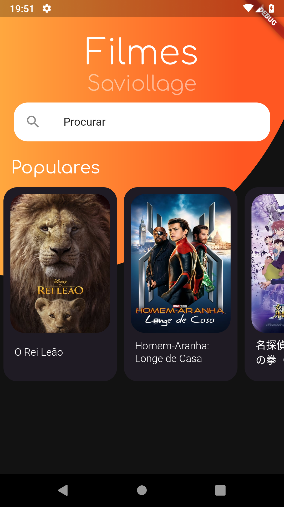

# Movie App by Saviollage

App consumindo a api TheMovieDB para listagem de filmes populares.

<table><tr>
  <td style="text-align: center">
    
</td>
  <td style="text-align: center">
    
</td>
  <td style="text-align: center">
    
</td>
  
</tr></table>

Para este exemplo utilizamos alguns temas importantes do *Flutter*, como por exemplo: 
- Requisição HTTP 
- Async / Await
- Tratamento de erros
- Tratamento de JSON
- Custom Painting

## Contributing
Pull requests are welcome. For major changes, please open an issue first to discuss what you would like to change.

Please make sure to update tests as appropriate.

## License
[MIT](https://choosealicense.com/licenses/mit/)
